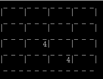
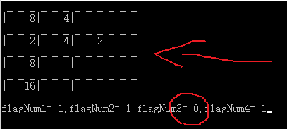
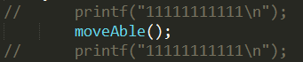
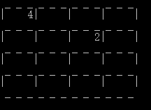

# 总体设计

##### It's your time ,stop to think!

>2048的规则是什么？整个游戏过程有哪些细则易被忽略？
>开始游戏时，会先做什么？
>界面如何实时显示现在的格子情况？
>按键盘的上下左右键如何动作？之后会怎样？
>有没有按了方向键，没有变化的时候？
>何时游戏结束？格子全满？


##### Answers:
会随机2个位置生成2or4，如何做到位置不重复（新生成的位置不会在当前已有数字的位置）？

响应便是遇到紧邻的相同数字合并，**合并过就不能再合并了**,并向此方向堆叠移动，之后在剩余空间产生一个新数字2or4。

如果按下方向键，不会移动，不会合并时，不会产生新的数字，并且如果4个方向均不能动，则游戏结束，此时格子一定全满；而格子全满是游戏结束的必要不充分条件，故不能用格子满来判定游戏结束。

##### 函数原型设计

```c
void displayTable();
void init();
void placeNumber();
void oneMove();
void moveAble();
```

# 设计细节

##### 全局二维数组，是零不显示
字符版low比界面，纯控制台打印。<br>
初始化效果展示：



根据效果图，写出打印格子的代码。注意数字始终右对齐。

##### 最好对数组进行0初始化
和是否是静态，全局变量有关，可能随机，可能零，所以保险每次都手工初始化。

##### 关于rand()和srand()
```c
int rand(void)；
//从srand (seed)中指定的seed开始，返回一个[seed, RAND_MAX（0x7fff）（15个1）)间的随机整数。

void srand(unsigned seed)；
//参数seed是rand()的种子，用来初始化rand()的起始值。

```
c语言中如果单独调用<code>rand()</code>函数，每次程序运行产生的随机数值相同，因为给的默认种子值相同。所以，如果希望<code>rand()</code>在每次程序运行时产生的值都不一样，必须给<code>srand(seed)</code>中的seed一个变值(且必须在<code>rand()</code>之前调用),这个变值必须在每次程序运行时都不一样（比如到目前为止流逝的时间）。<br>
注意，一个程序产生多个随机数值是不同的。 <br>
<code>time(NULL)</code>函数是得到一个从1900年1月1日到现在的时间秒数，这样每一次运行程序的时间的不同就可以保证得到不同的随机数了。

最终我们的函数如下：
```c
srand((unsigned)time(NULL));//必须只有一个！否则每次种子值大致相同，随机数会相同
int num = rand();
```
回到我们的需求，是每次产生一个随机的位置（0-15）和一个随机要么2要么4的数值。要如何做呢？

##### 对键盘方向键的监听
用<code>getch()</code>，需引入<code>conio.h</code>按一个方向键，对应输入两个字符，可用两个变量分别接收，之后switch-case

键		       | 键码
:-------------:|---------
方向键(←)      | 0xe04b
方向键(↑)      | 0xe048
方向键(→)      | 0xe04d
方向键(↓)      | 0xe050

##### 预测，带来开销不可避免
开始的思路是每次移动，合并过程中改变标志变量，之后根据标志（一个就够了）判断是否新产生数字。<br>但，在设计何时游戏结束时发现，判断结束与否是在按键操作之前的，即需要预测4个方向还能否移动，合并（需要4个标志变量）。与移动函数区别只是不移动，只改变标志变量的值。

演示并测试<code>moveAble()</code>

<br>
*注：flagNum3为是否可左移标志，0代表不可移*

# 关于代码测试

#####设计测试数组
```c
//设计目的：是否会合并后再合并
//设计目的：是否会多个合并
//设计目的：是否会跳过非零合并
//测试方法：←
int table[4][4] ={
	{2,2,2,2},
	{0,2,2,2},
	{0,4,2,2},
	{2,0,4,2}
};
```
```c
//测试目的：是否能隔0合并
//测试方法：↓ ↑ ← →
int table[4][4] ={
	{0,4,0,4},
	{0,0,0,0},
	{0,4,0,0},
	{0,0,0,0}
};
```
```c
//设计目的：结束游戏测试
//测试方法：↓ ↑ ← →
int table[4][4] ={
	{256,4,128,4},
	{128,2,4,8},
	{2,4,8,16},
	{4,128,64,32}
};
```

#####程序能不能跑到某位置




#####本项目测试时每次都需要刷新棋盘，故普通的打印测试语句可能会被覆盖。
解决方案：在打印语句前清屏并延时
#####sleep函数的妙用
先介绍一下sleep函数<br>
关于sleep()函数在windows系统和linux系统下是两个不同的函数，差别较大，但功能是相同的，都是将进程挂起一段时间。

windows系统下
```c
//头文件
#include <windows.h>
//函数原型
void Sleep(DWORD dwMilliseconds); // 注意是大写！！参数为毫秒
```
linux系统下
```c
//头文件
#include <unistd.h>
//函数原型
unsigned int sleep(unsigned int seconds);//参数为毫秒 （如果需要更精确可以用usleep，单位为微秒）
```


例如两个模块顺序执行（在这里dispalayTable()和placeNumber()），后一个模块显示不明显（不易看出哪个是新出现的数字），用sleep()将其隔开，睡个2s，便可清晰观察。


